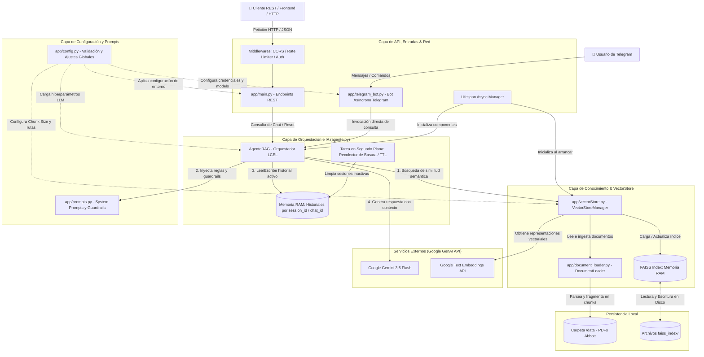

# Agente RAG - Asistente de Información Nutricional Abbott

Sistema inteligente backend desarrollado con **FastAPI**, **LangChain**, **Google Gemini (GenAI)** y **Telegram Bot**, diseñado para asistir a profesionales de la salud y usuarios respondiendo consultas nutricionales basadas estrictamente en las fichas técnicas y catálogos oficiales de productos Abbott mediante mensajería interactiva.

## 🔗 Enlaces de Acceso Directo

* 🤖 **Bot de Telegram:** [@Abbott_asistente_bot](https://t.me/Abbott_asistente_bot) — *Interacción directa por chat para consultas nutricionales.*
* 📄 **Documentación Swagger UI:** [https://agente-rag-backend-api.onrender.com/docs](https://agente-rag-backend-api.onrender.com/docs)
* 🔴 **Documentación ReDoc:** [https://agente-rag-backend-api.onrender.com/redoc](https://agente-rag-backend-api.onrender.com/redoc)
* 🟢 **Estado del Servicio (Health Check):** [https://agente-rag-backend-api.onrender.com/health](https://agente-rag-backend-api.onrender.com/health)

---

## Arquitectura de la Solución Implementada



## Estructura de Directorios

```
Backend/
├── app/                      # Núcleo de la aplicación
│   ├── main.py               # FastAPI, rutas HTTP y middlewares
│   ├── agente.py             # Lógica RAG y memoria por sesión
│   ├── vectorStore.py        # FAISS y embeddings
│   ├── document_loader.py    # Ingesta y parseo de PDFs
│   ├── config.py             # Variables de entorno y configuración
│   ├── prompts.py            # System Prompts y guardrails
│   └── telegram_bot.py       # Bot asíncrono para Telegram
├── data/                     # Repositorio documental fuente
├── faiss_index/              # Índice vectorial local (auto-generado)
├── static/                   # Recursos y plantillas
├── .env                      # Variables de entorno locales
├── requirements.txt          # Dependencias del proyecto
└── README.md                 # Documentación técnica
```

- **Flujo RAG de Baja Latencia:** Las consultas se procesan mediante **LCEL** (*LangChain Expression Language*), combinando recuperación semántica vectorial local con control estricto de temperatura del LLM (`0.0`) para evitar alucinaciones en datos nutricionales críticos.
- **Canales de Interacción Duales:** Soporte simultáneo para exposición mediante API REST (FastAPI) y un bot dedicado de Telegram (`app/telegram_bot.py`) que consume el núcleo del agente asegurando paridad en la experiencia conversacional.
- **Aislamiento de Sesiones y Seguridad:** Gestión concurrente de historiales en memoria RAM protegida con cerrojos asíncronos (`asyncio.Lock`), validación robusta de esquemas con Pydantic v2 y protección contra abuso mediante *Rate Limiting*.

## Tecnologías y Herramientas Utilizadas

| **Categoría** | **Tecnología / Herramienta** | **Descripción y Propósito** |
| --- | --- | --- |
| **Framework Backend** | **FastAPI** | Servidor asíncrono de alto rendimiento con validación automática de esquemas mediante Pydantic v2. |
| **Bot de Mensajería** | **python-telegram-bot** | Interfaz de chat asíncrona integrada para la interacción directa con el agente. |
| **Orquestación de IA / RAG** | **LangChain / LangChain Google GenAI** | Framework modular para la construcción del flujo RAG y la gestión de cadenas de ejecución (*LCEL*). |
| **Modelo de Lenguaje (LLM)** | **`gemini-3.5-flash`** | Motor generativo configurado mediante variables de entorno para respuestas rápidas y precisas. |
| **Motor Vectorial** | **FAISS** | Indexación y búsqueda de similitud local de alta velocidad para la recuperación documental. |
| **Seguridad y Resiliencia** | **SlowAPI / secrets** | Protección contra abusos mediante *Rate Limiting* y validación segura de tokens administrativos (`compare_digest`). |
| **Despliegue y Contenedores** | **Uvicorn / Render** | Contenedorización optimizada para garantizar la portabilidad y el despliegue estable en la nube. |

## Descripción Detallada de Componentes

| **Componente / Archivo** | **Descripción Detallada** |
| --- | --- |
| **`app/main.py`** | Punto de entrada del servidor asíncrono. Gestiona el ciclo de vida del sistema, endpoints REST y protección contra abuso mediante *Rate Limiting*. |
| **`app/agente.py`** | Orquestador del flujo RAG. Implementa LCEL y administra historiales conversacionales aislados por sesión con control de concurrencia. |
| **`app/vectorStore.py`** | Administrador de la base de datos vectorial. Encapsula la indexación y recuperación semántica de alta precisión utilizando FAISS. |
| **`app/document_loader.py`** | Módulo de procesamiento documental encargado de leer y fragmentar las fuentes PDF en chunks optimizados. |
| **`app/config.py`** | Módulo centralizado para la carga tipada y validación de variables de entorno del sistema. |
| **`app/prompts.py`** | Contiene los System Prompts, directrices clínicas y guardrails para asegurar respuestas deterministas. |
| **`telegram_bot.py`** | Interfaz conversacional paralela para Telegram integrada directamente con el núcleo del agente RAG. |

## Instrucciones de Ejecución del Proyecto

### 1. Prerrequisitos

- Python 3.11 o superior instalado.
- Llave de API oficial de Google Generative AI (`GEMINI_API_KEY`).
- Token de Bot de Telegram (`TELEGRAM_BOT_TOKEN`, opcional para canal de chat).

### 2. Configuración del Entorno Local

Clona el repositorio, crea un entorno virtual e instala las dependencias:

```
python -m venv venv
source venv/bin/activate  # En Windows: venv\Scripts\activate
pip install -r requirements.txt
```

### 3. Variables de Entorno

Crea un archivo `.env` en la raíz del proyecto basándote en la estructura de `static/.env.example`:

```
GEMINI_API_KEY=tu_clave_de_api_de_google_aqui
TELEGRAM_BOT_TOKEN=tu_token_de_telegram_aqui
ADMIN_TOKEN=un_token_secreto_seguro_para_indexar
```

### 4. Ejecución de los Servicios

- **Para iniciar la API REST (FastAPI):**
    
    ```
    python -m uvicorn app.main:app --reload --host 0.0.0.0 --port 8000
    ```
    
    *(Documentación interactiva* (Swagger UI) *en `http://localhost:8000/docs`)*
    
    *(Documentación alternativa* (ReDoc) *en `http://localhost:8000/redoc`)*
    
- **Para iniciar el Bot de Telegram:**
    
    ```
    python -m app.telegram_bot
    ```
